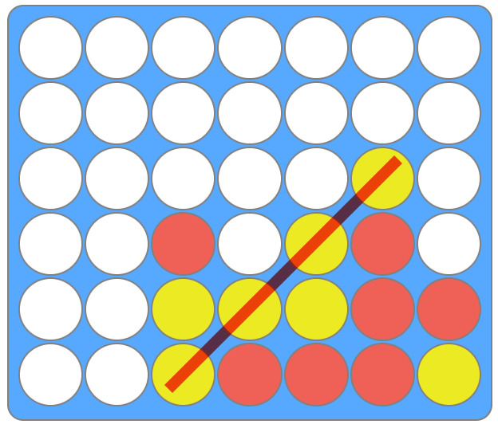
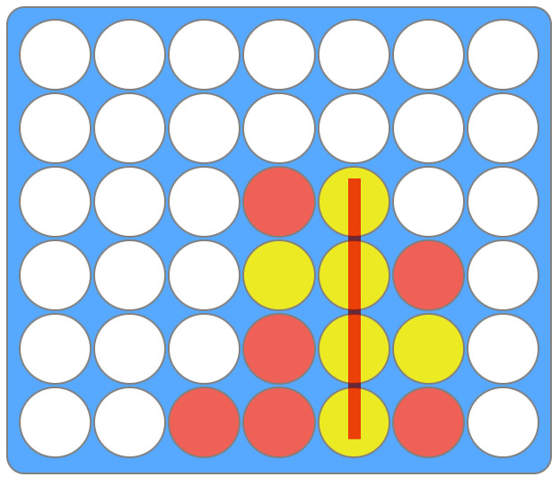
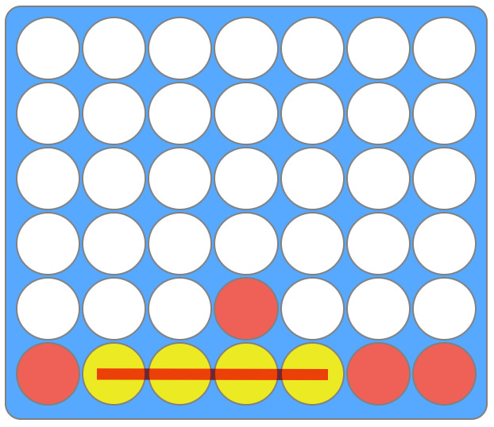
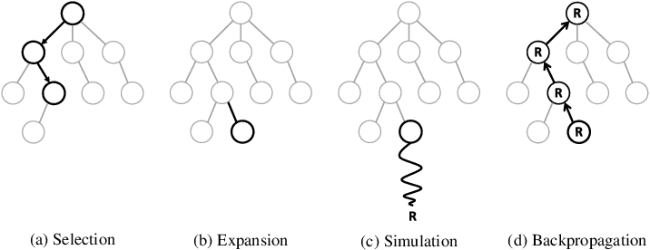

# Connect 4 Bot

Connect 4 is a two player board game, in which the players choose a color and then take turns
dropping colores discs into a 6x7 grid. The objective of the game is to be the first to form a
horizontal, vertical or diagonal line of four of one's own discs.

Winning Examples:






## Intro

In the notebook `classifier_train.ipynb` we trained a
[CatBoost](https://en.wikipedia.org/wiki/Catboost)
classifier using a Kaggle's
[dataset](https://www.kaggle.com/tbrewer/connect-4) of connect 4 played games.

In `web_app/bot_core.py` we defined the GameBot. Which implements a Monte Carlo Tree Search in order
to find the best bot move.

After that we developed a web application using Javascript and Python with Flask.

## Requirements and Run

The Bot is deployed into Heroku cloud in the following
[link](https://conecta4-bot.herokuapp.com/).

Also, to run on local, one need a Python 3.9 environment, with the following libraries:

1. [Flask](https://flask.palletsprojects.com/en/2.0.x/)
2. [NumPy](https://numpy.org/doc/stable/)
3. [CatBoost](https://catboost.ai/)

On terminal, enter the following:

```
pip install -r requirements.txt
```

to install the dependencies. Then enter

```
export FLASK_APP=web_app
```

to define the location of the app.

Finally, run

```
flask run
```

to mount the web app on localhost.

## What is a Monte Carlo Tree Search?

To predict Bot moves, the Python script executes the
[Monte Carlo Tree Search](https://en.wikipedia.org/wiki/Monte_Carlo_tree_search)
described in the following 4 steps:

### 1 - Selection

The Bot selects the current state of the game.

### 2 - Expansion

Now it expands the current state considering the three children. Depending on the state, the
considering games amount can grow up until 7x7x7 = 343 games.

### 3 - Simulation

Then for each expansion it simulates two games. Depending on the difficulty, the bot will look at a
large enough amount of future steps. If the game is not over after certain steps, the bot will use
the CatBoost classifier to predict if it is a win or a lose after choosing that game path.
Otherwise, the win rate corresponds to a 1 or 0 if the game has became a win or a lose for the bot.

### 4 - Backpropagation

Each probability is back propagated until the current game state. To get an average win rate for
every possible move, in order to select the best one.



## Support

Give a :star: if you like it :hugs:.
